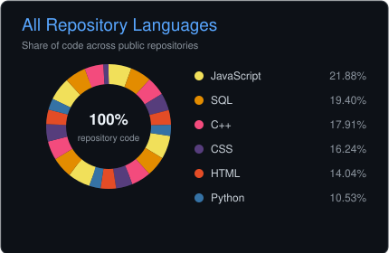

<h1 align="center">
  👋 Hi, I'm Henrique Gallassini
</h1>

  

  Software Development student focused on building web applications,
  intelligent automations and practical AI-powered solutions.

  
  

---

## 💻 Tech Stack

### 👨‍💻 Languages

&nbsp;&nbsp;&nbsp;&nbsp;&nbsp;&nbsp;&nbsp;&nbsp;&nbsp;

### 🌐 Frontend

&nbsp;&nbsp;&nbsp;

### 🗄️ Database & Backend

&nbsp;&nbsp;&nbsp;

### 🛠️ Development Tools

&nbsp;&nbsp;&nbsp;&nbsp;&nbsp;&nbsp;

### ⚙️ Automation

---

## 🎯 Current Focus

  
  
  

  
  
  

  
  
  

---

## ✨ Featured Projects

### 🧮 [BMI Calculator - JavaScript](https://github.com/henriquegallassini/Calculadora-IMC-Javascript)

Interactive BMI calculator built with JavaScript, HTML and CSS.

`JavaScript` `HTML5` `CSS3` `Frontend`

---

### 🔎 [AI Reviewer CLI](https://github.com/henriquegallassini/AI-Reviewer-CLI-V.1.0.0)

Intelligent Python code analyzer running directly in the terminal.

`Python` `CLI` `AI` `Code Analysis`

---

### 📄 [AI Document Classifier & SWOT](https://github.com/henriquegallassini/MAKE-AI-Automation-Doc-Classifier-Swot)

AI-powered automation for accounting and tax document classification and SWOT analysis.

`Make` `OpenAI` `Automation` `Document Processing`

---

### 🤖 [IRPF AI Automation](https://github.com/henriquegallassini/Make-AI-Automation-IRPF)

Automated workflow for document extraction, management and follow-up.

`Make` `AI` `PostgreSQL` `Supabase`

---

## 🆕 Latest Repositories

<!-- AUTO-REPOS:START -->
### 📦 [Calculadora-C-](https://github.com/henriquegallassini/Calculadora-C-)

🧮 Calculadora C++ Calculadora de terminal desenvolvida em C++ com menu interativo, validação de entradas e operações matemáticas essenciais.

`C++` `CMake`

⭐ 1 &nbsp;•&nbsp; Last push: 21 Aug 2026

---

### 📦 [DataDiff](https://github.com/henriquegallassini/DataDiff)

Public GitHub repository.

`JavaScript` `HTML` `CSS`

⭐ 1 &nbsp;•&nbsp; Last push: 17 Aug 2026

---

### 📦 [Calculadora-IMC-Javascript](https://github.com/henriquegallassini/Calculadora-IMC-Javascript)

Public GitHub repository.

`CSS` `JavaScript` `HTML`

⭐ 1 &nbsp;•&nbsp; Last push: 11 Aug 2026

---

### 📦 [Make-AI-Automation-IRPF](https://github.com/henriquegallassini/Make-AI-Automation-IRPF)

Automação integrada de IRPF com Make, Gemini, OpenAI, Supabase/PostgreSQL e Gmail para extração de dados, gestão de documentos e cobrança de pendências.

`SQL`

⭐ 1 &nbsp;•&nbsp; Last push: 17 Jul 2026

---

### 📦 [MAKE-AI-Automation-Doc-Classifier-Swot](https://github.com/henriquegallassini/MAKE-AI-Automation-Doc-Classifier-Swot)

Automação no Make com OpenAI para classificar documentos contábeis e fiscais, extrair dados e gerar análises SWOT.

`Repository`

⭐ 1 &nbsp;•&nbsp; Last push: 17 Jul 2026

---

### 📦 [AI-Reviewer-CLI-V.1.0.0](https://github.com/henriquegallassini/AI-Reviewer-CLI-V.1.0.0)

🔍 AI Reviewer CLI Um analisador de código Python inteligente que roda direto no terminal — sem API, sem custo, 100% local.

`Python`

⭐ 1 &nbsp;•&nbsp; Last push: 20 May 2026
<!-- AUTO-REPOS:END -->

---

## 📊 GitHub Analytics

&nbsp;

  

---

## 📈 Development Activity

  

---

## 🐍 Contribution Activity

  <picture>
    <source
      media="(prefers-color-scheme: dark)"
      srcset="https://raw.githubusercontent.com/henriquegallassini/henriquegallassini/output/github-contribution-grid-snake-dark.svg"
    />
    <source
      media="(prefers-color-scheme: light)"
      srcset="https://raw.githubusercontent.com/henriquegallassini/henriquegallassini/output/github-contribution-grid-snake.svg"
    />
    
  </picture>

---

## 🔍 Currently Learning

- 🌐 **Full Stack Development**
- 🟨 **JavaScript**
- 🔷 **TypeScript**
- ⚡ **C++ & Computer Science Fundamentals**
- ⚙️ **Backend Development**
- 🔌 **REST APIs & Integrations**
- 🐘 **PostgreSQL & Database Design**
- 🤖 **AI-powered Applications**
- 🏗️ **Software Architecture**

---

<b>🎯 About Me</b>

 

I'm a Software Development student focused on building practical
applications, intelligent automations and AI-powered solutions.

My current studies are focused on **Full Stack Development**, especially
JavaScript, TypeScript, backend development, APIs and databases.

I also study **C++ and Computer Science fundamentals** to strengthen my
understanding of programming, memory management, data structures and
software development.

I enjoy combining software development with **AI and automation** to solve
real-world business problems.

---

  <b>🚀 Always learning. Always building.</b>

